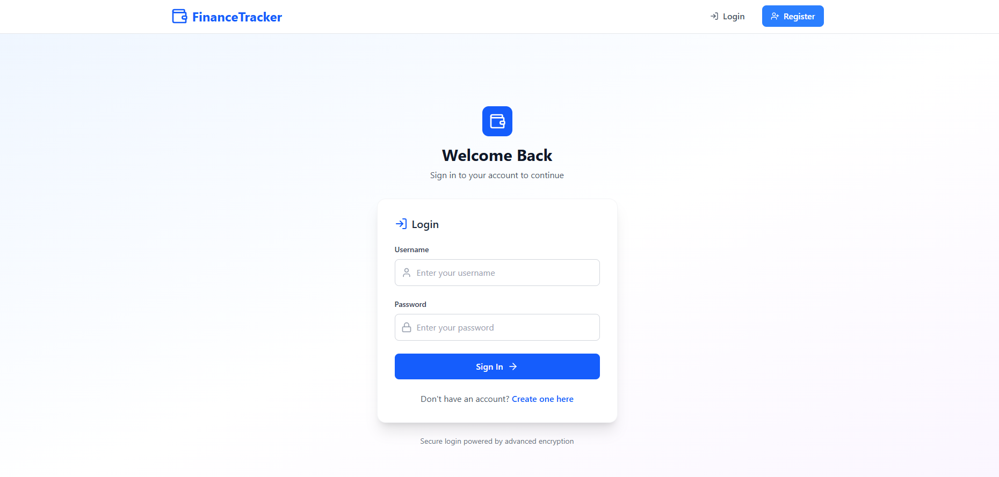
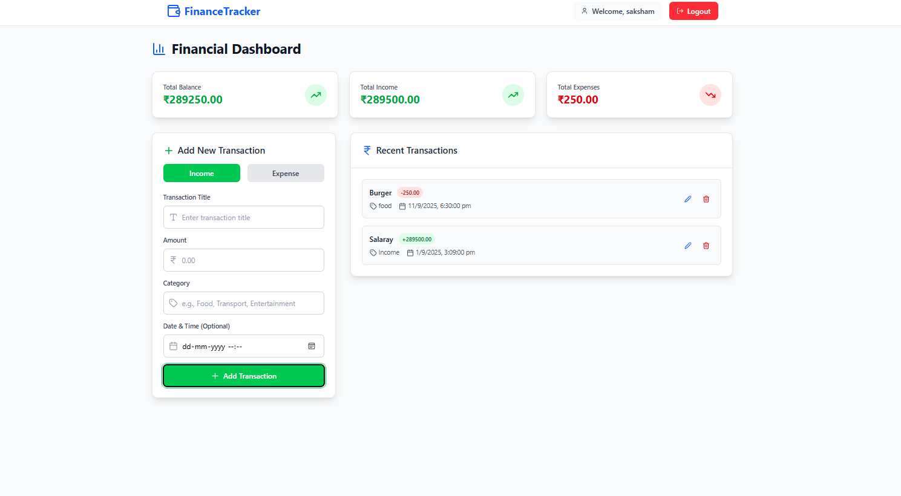

# 💰 TrackIt Finance – Stay on top of every rupee

TrackIt Finance is a MERN stack web app that helps you manage your personal finances.  
Users can register/login, add income or expenses, categorize them, and track transactions with ease.

---

## ✨ Features

- 🔐 User authentication (Register & Login)  
- ➕ Add, ✏️ Edit, ❌ Delete transactions  
- 📂 Categorize expenses/income  
- 📅 Track by date  

---

## 🛠️ Tech Stack

**Frontend:** React, Vite, TailwindCSS  
**Backend:** Node.js, Express.js  
**Database:** MongoDB  
**State Management:** Context API  
**Auth:** JWT (JSON Web Tokens)  

---

## 📂 Project Structure

```
/client   → Frontend (React + Vite)
/server   → Backend (Node + Express + MongoDB)
```

---

## ⚡ Getting Started

### 1️⃣ Clone the Repository
```bash
git clone https://github.com/SakshamChaurasiya/Personal_Finance_Tracker.git
cd Personal_Finance_Tracker
```

### 2️⃣ Backend Setup
```bash
cd server
npm install
```

Create a `.env` file inside `/server` and add:
```env
PORT=7001
CONECTION_STRING=your_mongo_url
JWT_SECRET=your_secret_key
```

Run the backend:
```bash
npm run dev
```

### 3️⃣ Frontend Setup
```bash
cd client
npm install
```

Create a `.env` file inside `/client` and add:
```env
VITE_API_BASE_URL=http://localhost:7001/api
```

Run the frontend:
```bash
npm run dev
```

---

## 📸 Screenshots  

### 🔐 Login Page  


### 📊 Dashboard  


---

## 👨‍💻 About the Developer

**Saksham Chaurasiya**  
B.Tech CSE `27  
Chameli Devi Group of Institutions, Indore  

#### 🔗 Connect with me  
[LinkedIn](https://www.linkedin.com/in/saksham-chaurasiya-14f/)  

---
